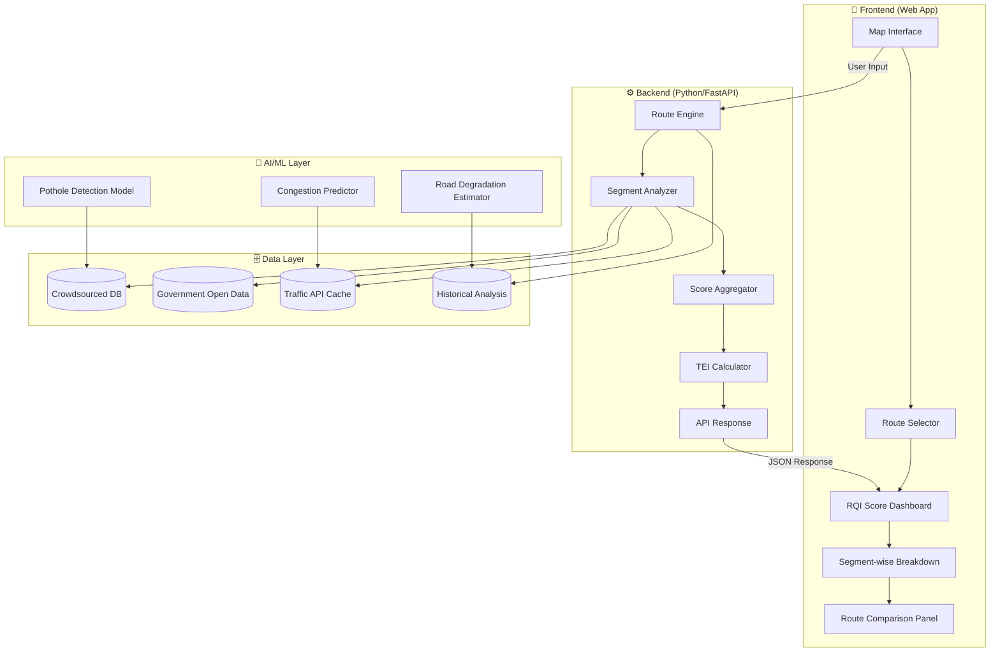

# 🛣️ PathSense India — Road Quality & Route Intelligence System

> **Hackathon Theme:** Sustainable Development of Cities (SDG 11)
> **Core Idea:** When a user sets a destination, show them a comprehensive **Road Quality Intelligence Score** covering congestion, potholes, surface quality, TEI (Traffic Environment Index), emissions, safety, and more — per route segment.

---

## 📊 Research: Does This System Already Exist?

### Short Answer: **NOT as a single unified system — and THAT's your winning edge.**

### Existing Solutions & Their Gaps

| System | What it Does | What it LACKS |
|--------|-------------|---------------|
| **Google Maps** | Traffic congestion, ETA, basic incident alerts | No road quality score, no pothole data, no surface condition, no TEI |
| **Waze** | Crowdsourced hazard alerts (potholes, police, crashes) | No composite quality score, no IRI, no emission impact, alerts only |
| **Mappls (MapmyIndia)** | Speed breaker/pothole alerts, India-specific | No unified quality index, no TEI, no emission analysis |
| **Intents Go** | Community-driven road condition alerts (India) | No scoring, no analytics, no sustainability metrics |
| **IndiaRoad Map** | AI pothole detection via phone sensors | Limited to pothole detection only, no routing intelligence |
| **Roadroid** | Professional IRI measurement via smartphone | Enterprise tool, no consumer routing, no congestion data |
| **RoadMetrics** | AI computer vision for road health mapping | Enterprise/govt tool, no consumer app, no real-time routing |
| **SmartRoadSense** | Crowdsourced accelerometer road quality | No routing, no congestion, no emission data |
| **Carbin (MIT)** | IRI estimation via smartphone | Research tool, no consumer product |
| **Rasta.AI** | 360° road inspection, AI monitoring | Enterprise govt tool, not consumer-facing |

### The GAP (Your Opportunity) 🎯

> [!IMPORTANT]
> **No existing system combines ALL these factors into ONE unified route intelligence score for consumers:**
> 1. Real-time congestion level
> 2. Pothole density & severity
> 3. Road surface quality (IRI-based)
> 4. TEI (Traffic Environment Index) — composite score
> 5. Emission impact per route
> 6. Safety score (lighting, accident history, pedestrian infrastructure)
> 7. Route comparison with quality-weighted alternatives
>
> **This is a BLUE OCEAN opportunity for a hackathon!**

---

## 🏗️ Proposed System: "PathSense India"

### Tagline
> *"Don't just navigate. Know your road."*

### Value Proposition
When a user enters Source → Destination, PathSense doesn't just show the fastest route — it shows the **healthiest route** with a comprehensive Road Quality Intelligence (RQI) score breakdown.

---

## 🧠 Architecture Overview



---

## 📐 TEI (Traffic Environment Index) — Custom Composite Score

This is the **core innovation**. TEI is a weighted composite score (0-100) that quantifies the overall "health" of a road segment:

### TEI Formula

```
TEI = w1·(Congestion Score) + w2·(Surface Quality) + w3·(Safety Score) 
    + w4·(Emission Impact) + w5·(Infrastructure Score) + w6·(Comfort Score)
```

### Factor Breakdown

| Factor | Weight | Data Source | How Measured |
|--------|--------|------------|-------------|
| **Congestion Score** | 25% | Google/HERE Traffic API | Live speed vs free-flow speed ratio |
| **Surface Quality (IRI)** | 20% | Crowdsourced accelerometer + Govt data | International Roughness Index (0-12 m/km) |
| **Pothole Density** | 15% | Crowdsourced reports + AI detection | Potholes per km, severity classification |
| **Safety Score** | 15% | Accident history + infrastructure audit | Street lighting, lane markings, accident frequency |
| **Emission Impact** | 10% | Calculated from congestion + stop frequency | CO2/NOx estimated per km based on avg speed |
| **Infrastructure Score** | 10% | OpenStreetMap + Govt data | Signage, dividers, pedestrian crossings, drainage |
| **Comfort Score** | 5% | Crowdsourced ratings | Speed bumps, sharp turns, noise level |

### TEI Grading Scale

| TEI Score | Grade | Color | Meaning |
|-----------|-------|-------|---------|
| 90-100 | A+ | 🟢 Green | Excellent — Smooth, safe, efficient |
| 75-89 | A | 🟢 Light Green | Good — Minor issues only |
| 60-74 | B | 🟡 Yellow | Average — Some caution needed |
| 40-59 | C | 🟠 Orange | Poor — Significant issues |
| 20-39 | D | 🔴 Red | Bad — Major road quality problems |
| 0-19 | F | ⚫ Black | Dangerous — Avoid if possible |

---

## 📁 Project Structure

```
PathSense-India/
├── frontend/                    # Web Application
│   ├── index.html              # Main map interface
│   ├── css/
│   │   ├── index.css           # Design system & tokens
│   │   ├── map.css             # Map-specific styles
│   │   └── dashboard.css       # Score dashboard styles
│   ├── js/
│   │   ├── app.js              # Main application logic
│   │   ├── map.js              # Map integration (Leaflet/Mapbox)
│   │   ├── route.js            # Route calculation & display
│   │   ├── tei.js              # TEI score calculation (client-side)
│   │   ├── dashboard.js        # Score visualization
│   │   └── crowdsource.js      # User reporting module
│   └── assets/
│       ├── icons/              # Custom map markers & icons
│       └── images/             # Branding assets
│
├── backend/                    # Python FastAPI Backend
│   ├── main.py                 # FastAPI application
│   ├── routes/
│   │   ├── routing.py          # Route calculation endpoints
│   │   ├── scoring.py          # TEI scoring endpoints
│   │   └── crowdsource.py      # User report endpoints
│   ├── models/
│   │   ├── tei_model.py        # TEI calculation engine
│   │   ├── pothole_detector.py # ML pothole detection
│   │   └── congestion_pred.py  # Congestion prediction
│   ├── data/
│   │   ├── road_segments.json  # Pre-analyzed road data
│   │   ├── accident_data.csv   # Historical accident data
│   │   └── infrastructure.json # Infrastructure audit data
│   └── utils/
│       ├── traffic_api.py      # Traffic API integration
│       ├── osm_parser.py       # OpenStreetMap data parser
│       └── emission_calc.py    # Emission estimation
│
├── ai-service/                 # ML Models
│   ├── pothole_model/         # Trained pothole detection model
│   ├── road_degradation/      # Road wear prediction model
│   └── training/              # Training scripts & notebooks
│
├── data/                      # Datasets
│   ├── sample_routes.json     # Demo route data
│   ├── delhi_road_quality.csv # Sample city data
│   └── highway_segments.csv   # Highway quality data
│
├── docs/                      # Documentation
│   ├── TEI_Methodology.md     # TEI scoring methodology
│   ├── API_Reference.md       # API documentation
│   └── Architecture.md        # System architecture
│
├── presentation/              # Hackathon presentation
│   ├── pitch_deck.pptx
│   └── demo_video/
│
├── requirements.txt
├── README.md
└── run.bat                    # Quick start script
```

---

## 🎨 Frontend Features (Web App)

### Screen 1: Landing Page
- Hero section with animated road visualization
- "Enter Source & Destination" input
- Quick stats: "X roads analyzed | Y potholes reported | Z users contributing"

### Screen 2: Route Analysis Dashboard
- **Interactive Map** with color-coded route segments (Green → Red based on TEI)
- **Route Comparison Panel** — Up to 3 alternative routes with TEI comparison
- **Segment-wise Breakdown** — Click any road segment to see detailed scores
- **TEI Gauge** — Animated gauge showing overall route TEI score

### Screen 3: Detailed Segment View  
- Per-segment breakdown: Congestion, Potholes, Surface Quality, Safety, Emissions
- Historical trend charts (is this road getting better or worse?)
- User reports & photos
- Estimated vehicle wear cost per route

### Screen 4: Crowdsource Reporter
- Quick report: Pothole / Road damage / Poor lighting / Flooding
- Photo upload with GPS auto-tag
- Community verification system (upvote/downvote reports)

### Screen 5: City Dashboard (Admin/Govt View)
- Heatmap of road quality across the city
- Priority maintenance zones
- Monthly improvement tracking
- Budget allocation recommendations

---

## 🔧 Tech Stack

| Layer | Technology | Why |
|-------|-----------|-----|
| **Frontend** | HTML/CSS/JS + Leaflet.js | Lightweight, no framework dependency |
| **Map Tiles** | OpenStreetMap + Mapbox | Free tier + beautiful styling |
| **Backend** | Python FastAPI | Fast, async, ML-friendly |
| **Database** | SQLite (demo) → PostgreSQL+PostGIS (prod) | Geospatial queries |
| **Traffic Data** | HERE Maps API / TomTom API | Real-time traffic flow |
| **ML/AI** | TensorFlow Lite / scikit-learn | Pothole detection, predictions |
| **Hosting** | Cloudflare Pages (frontend) + Railway (backend) | Free tier, fast deploy |

---

## 🏆 Why This Wins a Hackathon

### SDG 11 Alignment (Sustainable Cities & Communities)
1. **Target 11.2** — Improve road transport systems → PathSense helps identify & prioritize road improvements
2. **Target 11.6** — Reduce environmental impact → Emission-aware routing reduces urban pollution
3. **Target 11.7** — Safe public spaces → Safety scoring improves pedestrian & driver safety

### Innovation Factors
| Factor | Score | Reason |
|--------|-------|--------|
| **Novelty** | ⭐⭐⭐⭐⭐ | No unified consumer system exists |
| **Impact** | ⭐⭐⭐⭐⭐ | Directly affects millions of daily commuters |
| **Feasibility** | ⭐⭐⭐⭐ | Built on existing APIs & open data |
| **Scalability** | ⭐⭐⭐⭐⭐ | Crowdsourced = more users = better data |
| **Sustainability** | ⭐⭐⭐⭐⭐ | Self-improving system with community |

### Differentiators from Competition
1. **Composite TEI Score** — No one else has this unified metric
2. **Emission-Aware Routing** — Ties directly into GLOSA-BHARAT's emission work
3. **Crowdsource + AI Hybrid** — Better than either alone
4. **City Dashboard** — Government stakeholder appeal
5. **Vehicle Wear Cost Estimation** — Unique economic angle

---

## 📋 Implementation Phases

### Phase 1: Core MVP (2-3 days) — Hackathon Sprint
- [ ] Project setup & design system
- [ ] Map interface with route input (Leaflet.js + OpenStreetMap)
- [ ] Simulated TEI scoring engine with sample data
- [ ] Route visualization with color-coded segments
- [ ] TEI dashboard with animated gauges & charts
- [ ] Route comparison panel
- [ ] Basic crowdsource report form

### Phase 2: Data Integration (Post-hackathon)
- [ ] HERE/TomTom Traffic API integration
- [ ] OpenStreetMap infrastructure data parsing
- [ ] Government open data integration (road audit data)
- [ ] Historical accident data

### Phase 3: AI/ML Layer
- [ ] Pothole detection from accelerometer data
- [ ] Congestion prediction model
- [ ] Road degradation trend analysis
- [ ] IRI estimation from smartphone sensors

### Phase 4: Scale & Polish
- [ ] PostgreSQL + PostGIS for geospatial queries
- [ ] User authentication & gamification
- [ ] Mobile PWA version
- [ ] City admin dashboard
- [ ] API for third-party integration

---

## 🔗 Connection to GLOSA-BHARAT

> [!TIP]
> This project can be positioned as an **extension of your GLOSA-BHARAT ecosystem**:
> - GLOSA-BHARAT optimizes **traffic signals** to reduce emissions
> - PathSense optimizes **route selection** based on road quality
> - Together they form a **complete Sustainable Urban Mobility Intelligence Platform**

---

## User Review Required

> [!IMPORTANT]
> **Key Decisions Needed:**
> 1. **Project Name** — "PathSense India" is a suggestion. Do you want a different name?
> 2. **Scope** — Should we build the full MVP now, or start with just the frontend demo?
> 3. **Map Provider** — Leaflet (free, open-source) vs Mapbox (prettier, has free tier)?
> 4. **Data** — Should we use simulated data for the hackathon demo, or try to integrate real APIs?
> 5. **Deployment** — Cloudflare Pages like your other projects?
> 6. **Timeline** — Is this for an upcoming hackathon? What's the deadline?

---

## Verification Plan

### Automated Tests
- Frontend renders correctly across browsers
- TEI calculation produces valid scores (0-100 range)
- Route visualization correctly color-codes segments
- API endpoints return valid JSON responses

### Visual Verification  
- Map loads and is interactive
- Routes display with proper color coding
- Dashboard gauges animate smoothly
- Responsive design works on mobile/tablet
- Dark mode aesthetics are premium

### Demo Scenario
- User enters "Connaught Place → IGI Airport, Delhi"
- System shows 3 routes with different TEI scores
- User can click segments to see detailed breakdown
- User can report a pothole on the map
- Admin dashboard shows city-wide road quality heatmap
